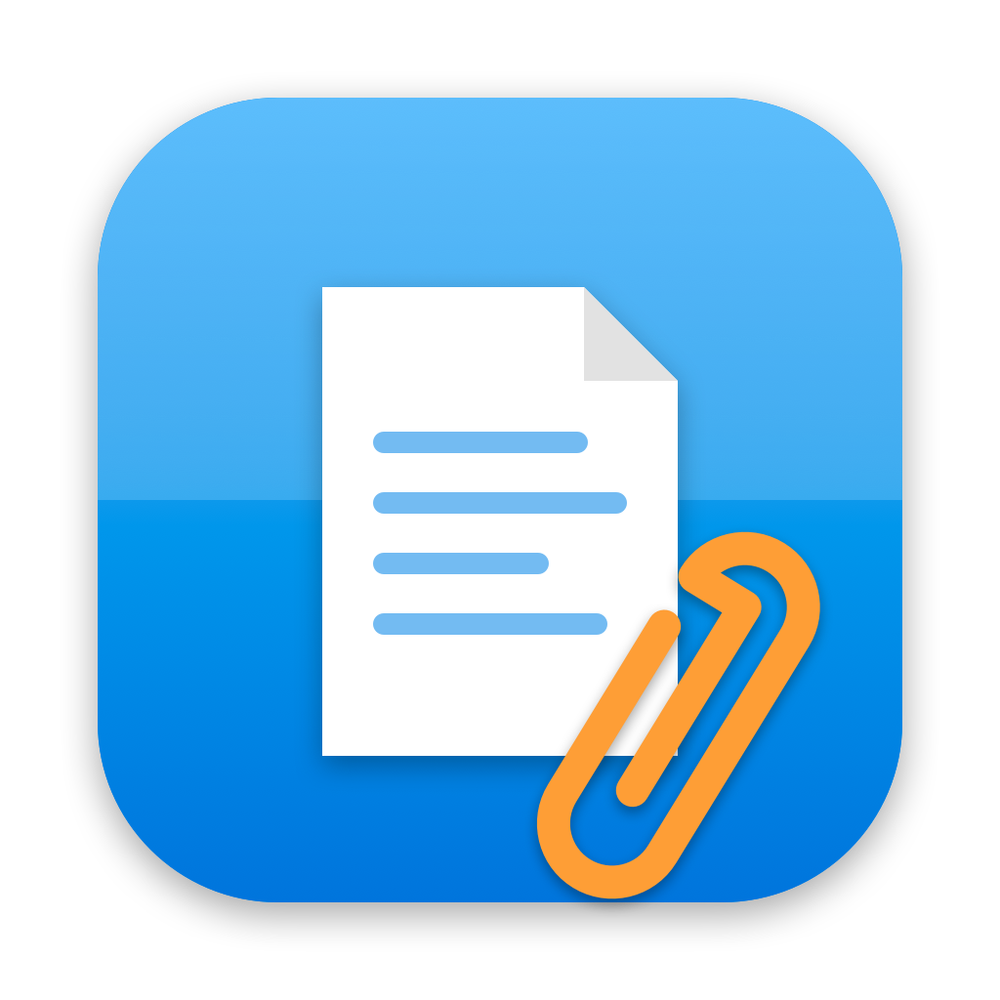

<p align="center">
  
</p>

<h1 align="center">Estrai Allegati</h1>

<p align="center">
  App macOS nativa per estrarre i file incorporati (PDF, TXT, Excel, …) da documenti Word, Excel e PowerPoint.<br>
  Niente Windows, niente Parallels, niente dipendenze.
</p>

<p align="center">
  <a href="../../releases/latest"></a>
  
  
  <a href="LICENSE"></a>
</p>

---

## Perché

Word per Mac mostra gli oggetti incorporati (icona + nome) ma non permette di salvarli su disco:
l'unica via è aprire il documento su Windows. **Estrai Allegati** legge il documento e ti restituisce
gli allegati con nome ed estensione originali, direttamente sul Mac.

## Installazione

1. Scarica `Estrai Allegati.dmg` dall'ultima [release](../../releases/latest).
2. Trascina l'app in **Applicazioni**.
3. Primo avvio: l'app non è notarizzata → tasto destro → **Apri** → **Apri**
   (su macOS 15+: *Impostazioni di Sistema → Privacy e sicurezza → Apri comunque*).

## Uso

- Trascina il documento nella finestra (anche più file), premi **⌘O**, oppure trascina il documento
  sull'icona dell'app / *Apri con…* dal Finder.
- Per ogni allegato: **Apri**, **Salva…**, o trascina la riga direttamente sul Finder.
- **Salva tutti…** salva l'intera lista in una cartella e la mostra nel Finder.

Tutto avviene in locale, nessun dato lascia il Mac.

## Formati supportati

| Documento | Formato |
|---|---|
| Word | `.docx` `.docm` `.dotx` `.dotm` `.doc` `.dot` |
| Excel | `.xlsx` `.xlsm` `.xltx` `.xltm` `.xls` `.xlt` |
| PowerPoint | `.pptx` `.pptm` `.potx` `.ppt` `.pot` |

Oggetti incorporati riconosciuti:

- **Package** (file generico inserito con *Inserisci → Oggetto → Crea da file*): nome originale dallo stream `Ole10Native`
- **Acrobat / PDF** e altri oggetti con stream `CONTENTS`: nome ricavato dalla didascalia dell'icona (EMF)
- **Excel / Word / PowerPoint / Outlook** incorporati come compound file
- File già in chiaro dentro `embeddings/` (`.docx`, `.xlsx`, `.pdf`, …)

## Come funziona

Tutto in Swift, senza librerie esterne:

- `src/Extractor.swift` — lettore ZIP (Compression framework), parser OLE2 / Compound File Binary
  (FAT, mini-FAT, directory tree), parser EMF per la didascalia dell'icona, riconoscimento tipo file da magic bytes.
- `src/EstraiAllegati.swift` — interfaccia SwiftUI: drag & drop, pannelli di salvataggio, apertura da Finder.
- `src/make_icon.swift` — genera l'icona con AppKit.

## Build

Richiede Xcode (per `swiftc`).

```bash
src/build_app.sh          # → Estrai Allegati.app (universale arm64 + x86_64) e Estrai Allegati.dmg
src/publish.sh v1.0.0     # push + GitHub Release con il DMG (richiede gh autenticato)
```

## Licenza

[MIT](LICENSE)
